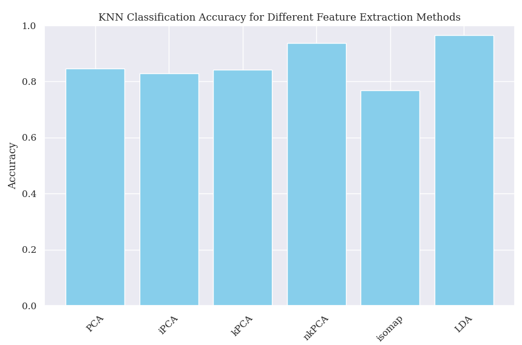

# **Hyperspectral Data Analysis Repository**

## table of contents:
   - [**Introduction**](#introduction)
   - [**projects**](#projects)
     - [project 1: aqusation of hyperspectral data](#project1)
     - [project 2: comparison of methods of feature extraction](#project2)
   - [**installation**](#installation)
___
## introduction
This repository contains two distinct but related projects focused on hyperspectral data analysis:
1. **Gathering Hyperspectral Data from USGS**: A project dedicated to collecting hyperspectral data from the United States Geological Survey [(USGS)](https://earthexplorer.usgs.gov/) database.
2. **Comparing Feature Extraction Methods**: A project that compares different methods of feature extraction on the hyperspectral data obtained in Project 1.

## projects

- ### project1 :
   Contains scripts and notebooks for downloading and preprocessing hyperspectral data from USGS.
   the data used for this project came from hyperion satellite with 240 bands . after processing and removing noise bands we have an image with 198 bands.here you can see the single band look and the same location in google earth image view.

   

   high-resolution image of the region

   

   band example from hyperscpectral image 

   

   ground truth which is made in 4 classes of urban area , tree , grassland and water-body

- ### Project2 :  
   In this project we calculated the intrinsic dimension for hyperion image with 198 bands using ipca method .considering the region of our image **25** feature was the best number of features. after that we applied different methods of feature extraction including PCA(principal component analysis) , KPCA( kernel principal component analysis) , IPCA(incremental principal component analysis) , ISOMAP and LDA(linear discriminant analysis) . 
   here is the resulting features extracted and the scatter plots for each method.
   
   **PCA** :

   Principal Component Analysis (PCA) is a statistical technique used for dimensionality reduction, which transforms a large set of variables into a smaller one that still contains most of the information in the large set. It is often used in data preprocessing for machine learning and in exploratory data analysis to simplify datasets, reduce noise, and make patterns more detectable.

   Principal Component Analysis (PCA) works through the following steps:

   * **Standardize the Data**: Ensure all variables have a mean of zero and the same variance.
   * **Compute Covariance Matrix**: Determine the covariance matrix to understand variable relationships.
   * **Eigenvalues and Eigenvectors**: Calculate these for the covariance matrix to identify principal components.
   * **Select Principal Components**: Choose the top eigenvectors based on their eigenvalues, which   represent the most variance.
   * **Transform Data**: Project the original data onto the selected principal components to form a reduced dataset.
   
   here are features extracted from pca method :

   

   the scatter-plot for four classes in first 3 feature extracted from pca method is shown bellow : 

   


   **IPCA** : 

   Incremental Principal Component Analysis (Incremental PCA) is a variant of PCA designed to handle large datasets that cannot fit into memory. It processes the data in smaller, manageable batches.
   incremental Principal Component Analysis (IPCA) works through the following steps:
   * **Standardize the Data**: Standardize each batch of data to have a mean of zero and unit variance.
   * **Batch Processing**: Divide the dataset into smaller batches that can fit into memory.
   * **Compute Covariance Incrementally**: For each batch, update the covariance matrix incrementally rather than computing it for the entire dataset at once.
   * **Incremental Eigenvalue and Eigenvector Update**: Update the eigenvalues and eigenvectors incrementally with each new batch, adjusting the principal components based on the new data.
   * **Combine Results**: After processing all batches, combine the results to form the final principal components.
   * **Transform Data**: Project the original data onto the final principal components to form a reduced dataset.

   here are features extracted from ipca method :

   

   the scatter-plot for four classes in first 3 feature extracted from ipca method is shown bellow : 

   

   **Kernel PCA** : 

   Kernel Principal Component Analysis (Kernel PCA) is an extension of PCA that uses kernel methods to handle non-linear relationships within the data. It allows for capturing more complex patterns by mapping data into higher-dimensional spaces.
   kernel Principal Component Analysis (IPCA) works through the following steps:

   * **Choose a Kernel**: Select a kernel function (e.g., polynomial, Gaussian) to map the original data into a higher-dimensional space.
   * **Compute Kernel Matrix**: Calculate the kernel matrix (Gram matrix), which contains the inner products of all pairs of data points in the high-dimensional space.
   * **Center the Kernel Matrix**: Adjust the kernel matrix to ensure it is centered (mean is zero in the high-dimensional space).
   * **Eigenvalue and Eigenvector Computation**: Calculate the eigenvalues and eigenvectors of the centered kernel matrix. These correspond to the principal components in the high-dimensional space.
   * **Select Principal Components**: Choose the top eigenvectors based on their eigenvalues, representing the directions of maximum variance in the high-dimensional space.
   * **Transform Data**: Project the original data onto the selected principal components using the kernel function to obtain the reduced dataset.

   here are features extracted from kpca method :

   

   the scatter-plot for four classes in first 3 feature extracted from kpca method is shown bellow : 

   

   **ISOMAP** : 

   Isomap (Isometric Mapping) is a nonlinear dimensionality reduction technique that aims to preserve the geodesic distances between data points, effectively capturing the underlying manifold structure.
   isomap works through the following steps:

   * **Construct the Neighborhood Graph**: Identify the nearest neighbors for each data point (using 
   k-nearest neighbors or a fixed radius).
   * **Compute Shortest Paths**: Calculate the shortest path distances between all pairs of data points on the neighborhood graph, typically using the Floyd-Warshall or Dijkstra's algorithm. These shortest paths approximate the geodesic distances on the manifold.
   * **Construct the Distance Matrix**: Form a matrix of these shortest path distances.
   * **Apply Multidimensional Scaling (MDS)**: Perform classical MDS on the distance matrix to find a lower-dimensional embedding that preserves the geodesic distances.
   * **Select Principal Components**: Extract the top eigenvectors of the resulting matrix, which represent the new dimensions.
   * **Transform Data**: Project the original data onto the lower-dimensional space formed by these eigenvectors.

   here are features extracted from isomap method :

   

   the scatter-plot for four classes in first 3 feature extracted from isomap method is shown bellow : 

   

   **LDA**:
   Linear Discriminant Analysis (LDA) is a dimensionality reduction technique primarily used for classification. It maximizes the separation between multiple classes by finding a new feature space that best discriminates between them.
   Linear Discriminant Analysis works through the following steps:

   * **Compute the Mean Vectors**: Calculate the mean vector for each class in the dataset.
   * **Compute the Scatter Matrices**:
      * **Within-class scatter matrix (Sw)**: Measures the scatter (spread) of data points within each class.
      * **Between-class scatter matrix (Sb)**: Measures the scatter between the mean vectors of different classes.
   * **Compute Eigenvalues and Eigenvectors**:
   Solve the generalized eigenvalue problem for the matrix (Sb^-1)(Sw). The eigenvalues represent the variance explained by each new axis (discriminant component), and the eigenvectors define the directions of these axes.
   * **Select Discriminant Components**:
   Choose the top eigenvectors based on their corresponding eigenvalues. The number of components selected is usually one less than the number of classes.
   Transform Data: Project the original data onto the selected discriminant components, forming a new feature space that enhances class separability.
   here are features extracted from lda method :

   

   the scatter-plot for four classes in first 3 feature extracted from lda method is shown bellow : 

   

   ### **method comparison** : 

   After creating components using PCA, Incremental PCA (IPCA), Kernel PCA (KPCA), LDA, and Isomap, we used the k-nearest neighbors (k-NN) method for classification to classify images according to the test and train data and the relative ground truth. Accuracy results for the 5 methods is shown bellow : 

      


   | Dimension Reduction Method | Accuracy |
   |----------------------------|----------|
   | PCA                        | 85%      |
   | IPCA                       | 83%      |
   | KPCA                       | 87%      |
   | LDA                        | 90%      |
   | Isomap                     | 84%      |


   Why LDA Had the Best Results:
   LDA is specifically designed to maximize class separability, making it inherently suitable for classification tasks. Unlike PCA and its variants (IPCA and KPCA), which focus on capturing the overall variance in the data, LDA seeks directions that maximize the distance between class means while minimizing the spread within each class. This makes the feature space more discriminative for the classification algorithm.

   Key reasons for LDA's superior performance:

   * **Class Separability**: LDA optimizes the new feature space to enhance the distinction between different classes, leading to better classification boundaries for the k-NN algorithm.
   * **Supervised Learning**: Unlike PCA methods, which are unsupervised, LDA uses class label information during the dimensionality reduction process. This supervised approach ensures that the transformation is guided by the actual class structure in the data.
   * **Reduced Overfitting**: By focusing on the most discriminative features, LDA helps reduce overfitting, especially when dealing with high-dimensional data and relatively small sample sizes.
   * **Efficient Dimensionality Reduction**: LDA reduces the dimensionality to one less than the number of classes, which is often sufficient for capturing the essential structure needed for accurate classification.

   Overall, LDA's ability to incorporate class information and focus on maximizing class separability gives it an edge in classification tasks, resulting in higher accuracy compared to PCA, IPCA, KPCA, and Isomap.

## Installation

To run the projects in this repository, you need to have Python installed along with some specific packages. You can install the required packages using the following command:

```bash
pip install -r requirements.txt 
```
___
